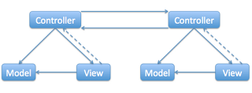

#[MVP plus UiBinder example](http://moradanen.sopovs.com/2011/09/mvp-plus-uibinder-example.html)

> Here [http://code.google.com/webtoolkit/articles/mvp-architecture-2.html](http://code.google.com/webtoolkit/articles/mvp-architecture-2.html) you may read about putting together MVP pattern promoted by Google for GWT development and UiBinder for xml declarative UI development for GWT.
> However, the example for download on this page is totally broken. Here are changes to it made in this repo:
>
> 1. Eclipse configuration was added (.project, .classpath, .settings). GWT 2.4 and 2.4 Google plugin were used.
> 2. Proper history support for editing contacts was added (ability to move back and forward in browser to editing particular contacts, that is absent in both 1st and 2nd original exmaples for MVP).
> 3. Black magic of native HTML for table was replaced with binded FlexTable for ContactsView
> 4. EditContactsView was implemented with UiBinder as well.
> 5. EventBus instead of non-recomened to this purpose HandlerManager was used.
> 6. Code cleanup (several bugs were fixed, unused third domain object Address was removed, etc.)
>
> If you are not familiar with git - just download to archive and import it to Eclipse as an existing project:
>
> - Zipped archive - [https://github.com/isopov/mvp-uibinder/zipball/master](https://github.com/isopov/mvp-uibinder/zipball/master)
> - tar.gz archive - [https://github.com/isopov/mvp-uibinder/tarball/master](https://github.com/isopov/mvp-uibinder/tarball/master)

##[Markdown](https://ru.wikipedia.org/wiki/Markdown)

Описание проекта
--------
###Веб-страницы:
* (Вид) **ContactListView** <-- (бин) **ContactList** --> (контролер) **ContactListPresenter**
* (Вид) **ContactPersonView** <-- (бин) **ContactPerson** --> (контролер) **ContactPersonPresenter**

###Операции:
* `(обработчик) delete`: [ContactDeleteEvent](ContactDeleteEvent) -->
* `(List-обработчик) add`: [ContactAddEvent](ContactAddEvent) --> (контролер) [ContactListPresenter](ContactListPresenter) & [AppController](AppController)
* `(List-обработчик) edit`: [ContactEditEvent](ContactEditEvent) --> (контролер) [ContactListPresenter](ContactListPresenter) & [AppController](AppController)
* `(Person-обработчик) edit-cancel`: [ContactCancelEditledEvent](ContactCancelEditledEvent) --> (контролер) [ContactPersonPresenter](ContactPersonPresenter) & [AppController](AppController)
* `(Person-обработчик) update`: [ContactUpdateEvent](ContactUpdateEvent) --> (контролер) [ContactPersonPresenter](ContactPersonPresenter) & [AppController](AppController)

### [Alex Tretyakov Blog ** Разрабатываем приложение на Spring и GWT. Часть 5 - UiBinder](http://alextretyakov.blogspot.com/2012/08/ispolzuem-uibinder.html)
### [Alex Tretyakov Blog ** Используем Listener вместо GWT Event Bus ](http://alextretyakov.blogspot.com/2012/01/ispolzuem-listener-vmesto-event-bus.html)
### [Alex Tretyakov Blog ** Основы GWT Event Bus](http://alextretyakov.blogspot.com/2011/11/osnovy-raboty-s-gwt-eventbus.html)
> Для взаимодействия контроллеры могут иметь ссылки друг на друга. Но что будет, если их будет не 2, а 20? Это приведёт к высокой связанности между классами. Намного лучше, если контроллеры будут взаимодействовать с помощью шины событий (Event Bus). Каждый контроллер сможет создавать события (Event) и обрабатывать их (с помощью Event Handler), при этом он не будет зависеть от других контроллеров:

> Наше приложение будет содержать два виджеты... . При нажатии на кнопку...
>
> Когда пользователь будет нажимать на кнопку..., будет выбрасываться новое событие ...Event, ... будет должно обработать выброшенное событие и...
>
> 1. Создадим интерфейс обработчика события ...EventHandler в пакете '...client.event'. Интерфейс содержит наш-метод который должен...
> 2. Создадим класс события ...Event в том же пакете. Он содержит:
>    - переменную TYPE, которая определяет тип события
>    - метод getAssociatedType(), который возвращает тип события
>    - метод dispatch(), который вызывает метод clear() обработчика события
> 3. Кнопка будет реализована как класс ButtonView в пакете '...client.view'. Конструктор класса принимает экземпляр **SimpleEventBus**, который при нажатии на кнопку выбрасывает новое событие ...Event
> 4. Создадим главный класс приложения - '...App' в пакете '...client'
> 5. Создадим экземпляр шины событий **SimpleEventBus** и добавим нашу кнопку на страницу

### Фреймворк GWT MVP
> MVC (Model-Controler-View) - по своей сути этот фреймворк построен на паттерне "Observer" (Наблюдатель).
>
> MVP (Model-View-Presenter) - отличие этого фреймворка от MVC в том что его контроллер перенесен на клентскую сторону...

Клиентская часть GWT-приложения реализованая в фреймворке GWT MVP
=================================================================
(Дело в том что в GWT-приложении НЕсуществует физически множества (веб) страниц - GWT их только эммитирует/эмулирует... >> отсюда и появляются все сложности с созданием и использованием множественных контролером для (веб) страниц...)
Для каждой (веб) страницы делаем отдельный контролер.
(Веб) страница состоит из виджетов.
Так вот:
- Для каждого виджета создается:
  1. интерфейс обработчика события (от 'EventHandler' - здесь обявляем метод обработчика события)
  2. класс обработчика события (от 'GwtEvent' - здесь определение для обработчика события: 'тип события', 'dispatch', 'getAssociatedType')
- Для каждой (веб) страницы создается:
  1. интерфейс обработчика события (здесь обявляем метод обработчика события - он служит слабой связью между контролером и видом) >> он же является 'Place'-модулем, который хранит состояние/историю (веб) страницы для меж-страничного перехода...
  2. класс обработчика события (делаем привязку между обработчиком события вида + ClickEvent с полем документа 'ui.xml')
- В контролере создаем объект обработчиком события виджета и делаем привязку с обработчиком события вида
---------------------------------------------------------------------------------------------------------------------
По своей сути это описан описан способ переопределения для стандартного (метода) обработчика события...:
- То есть, в класе обработчике события для (веб) странице - прописываются все те стандартные действия что и в 'EntryPoint'
- а вот интерфейс для виджета обработчика события (от 'EventHandler') и интерфейс для (веб) страницы обработчика события - служат для объявления собственного метода обработчика события (который используется для слабой связи между контролером и видом)
+ А все это требуется только для одной цели: чтобы объединить множественные связи обработчиков событий (которые паралельно пересекаются) между несколькими контролерами в общую шину 'EventBus' - а потом чтобы просто вызваmь все это в 'EntryPoint' (эту мешанину, одним класом)
(+) В случае если нужен только один контролер - тогда используется 'ClickListener' (без шины 'EventBus', вместо ClickEvent) И в этом случае НЕнужно наследовать от 'EventHandler' интерфейс для виджета обработчика события...

- Моделью здесь (в GWT) является 'shared' ('shared', 'client', 'server') - это объект Бина (от 'Serializable'), который сериализируется.
- А все слои со своими виджетами (которые потом потом вкдючаются в RootPanel) описываются уже в самом документе 'ui.xml'
---------------------------------------------------------------------------------------------------------------------
- А сам же фреймворк GWT MVP построен на паттерне 'Observer' (Наблюдатель: где есть издатель и подписчики...)
- - - - - - - - - - - - - - - - - - - - - - - - - - - - - - - - - - - - - - - - - - - - - - - - - - - - - - - - - - -
// (Alex Tretyakov Blog ** Основы GWT-EventBus) http://alextretyakov.blogspot.com/2011/11/osnovy-raboty-s-gwt-eventbus.html
addClickHandler(new ClickHandler() {
    @Override
    public void onClick(ClickEvent event) {
        eventBus.fireEvent(new ClearEvent());
    }
});

// (github ** Home-GWT/MySampleApplication3) https://github.com/Home-GWT/MySampleApplication3/blob/master/src/com/sample/client/AppClient.java
button.addClickHandler(new ClickHandler() {
    public void onClick(ClickEvent event) {
        if (label.getText().equals("")) {
            AppService.App.getInstance().getMessage("Hello!", new MyAsyncCallback(label));
        } else {
            label.setText("");
        }
    }
});

// (Alex Tretyakov Blog ** Используем Listener вместо GWT-EventBus) http://alextretyakov.blogspot.com/2012/01/ispolzuem-listener-vmesto-event-bus.html
buttonView = new ButtonView(new ClearListener() {
    @Override
    public void clear() {
        textBoxView.clear();
    }
});

// (Введение в платформу веб-инструментария Google Web Toolkit) https://netbeans.org/kb/74/web/quickstart-webapps-gwt_ru.html
button.addClickListener(new ClickListener(){
    public void onClick(Widget w) {
        label.setVisible(!label.isVisible());
    }
});
...............................................................................................................
https://drive.google.com/file/d/0B418nT5Bo9w_engtSTdpVDllY2s/view ( https://github.com/Home-GWT/docs/blob/master/gwt-tutorial-ru.pdf )
https://netbeans.org/kb/74/web/quickstart-webapps-gwt_ru.html
https://github.com/Home-GWT/MySampleApplication3/blob/master/src/com/sample/client/AppClient.java
http://alextretyakov.blogspot.com/2011/11/osnovy-raboty-s-gwt-eventbus.html
http://alextretyakov.blogspot.com/2012/01/ispolzuem-listener-vmesto-event-bus.html
(GWT та системи управління проектами) http://dou.ua/lenta/articles/gwt-and-build-systems/

Стать на классе
-------[ Ctrl + Alt + Shift + U ]---------
Диаграмма классов

#GWT 2 Spring 3 JPA 2 Hibernate 3.5 – Eclipse и Maven 2
* [http://www.spring-source.ru/articles.php?type=manual&theme=articles&docs=article_13](http://www.spring-source.ru/articles.php?type=manual&theme=articles&docs=article_13)
** [http://www.javacodegeeks.com/2010/05/gwt-2-spring-3-jpa-2-hibernate-35-2.html](http://www.javacodegeeks.com/2010/05/gwt-2-spring-3-jpa-2-hibernate-35-2.html)
* [https://github.com/JobTest/vitrinaPredmainTask/blob/miratex-master/MyHibernate/pom.xml](https://github.com/JobTest/vitrinaPredmainTask/blob/miratex-master/MyHibernate/pom.xml)
** [https://github.com/JobTest/vitrinaPredmainTask/tree/miratex-master/lib](https://github.com/JobTest/vitrinaPredmainTask/tree/miratex-master/lib)

#Mybatis + Spring (XML | Annotation) Mapper
* [http://hmkcode.com/mybatis-spring-xml-annotation-mapper/](http://hmkcode.com/mybatis-spring-xml-annotation-mapper/)

#Как именовать интерфейс в java
* `Часто договариваются о соглашении имен: либо AppContext & IAppContext либо AppContextImpl & AppContext`: [http://www.sql.ru/forum/564382/soglashenie-po-imenovaniu-interfeysov-klassov](http://www.sql.ru/forum/564382/soglashenie-po-imenovaniu-interfeysov-klassov)
* `Есть несколько конвенций (добавлять I вначале полагаю пришло от С\С++). . На практике не встречал ниразу`: [http://www.cyberforum.ru/java-j2se/thread1215389.html](http://www.cyberforum.ru/java-j2se/thread1215389.html)
* [http://javatalks.ru/topics/38423](http://javatalks.ru/topics/38423)
